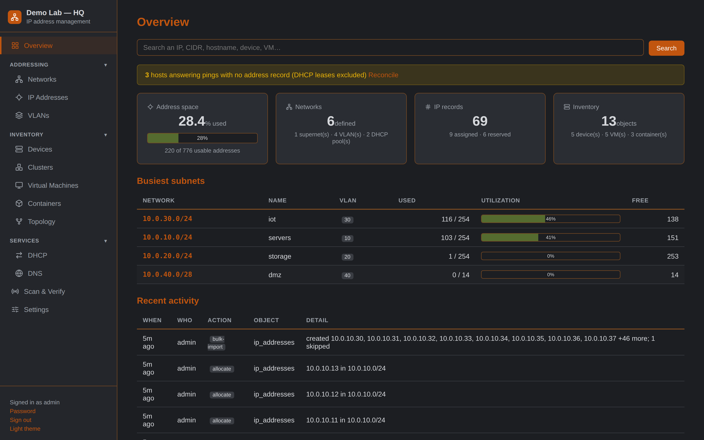
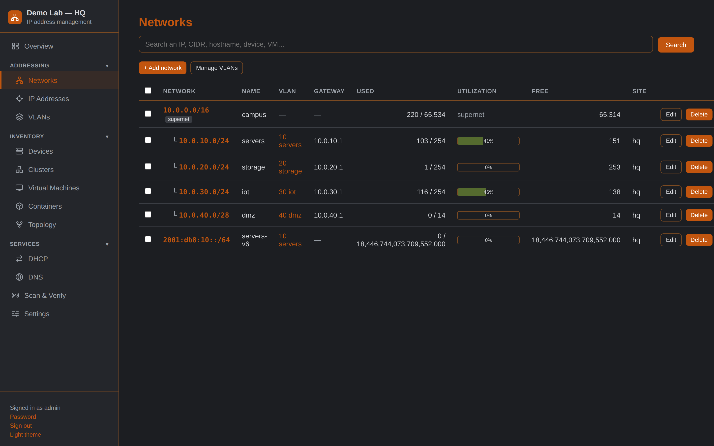
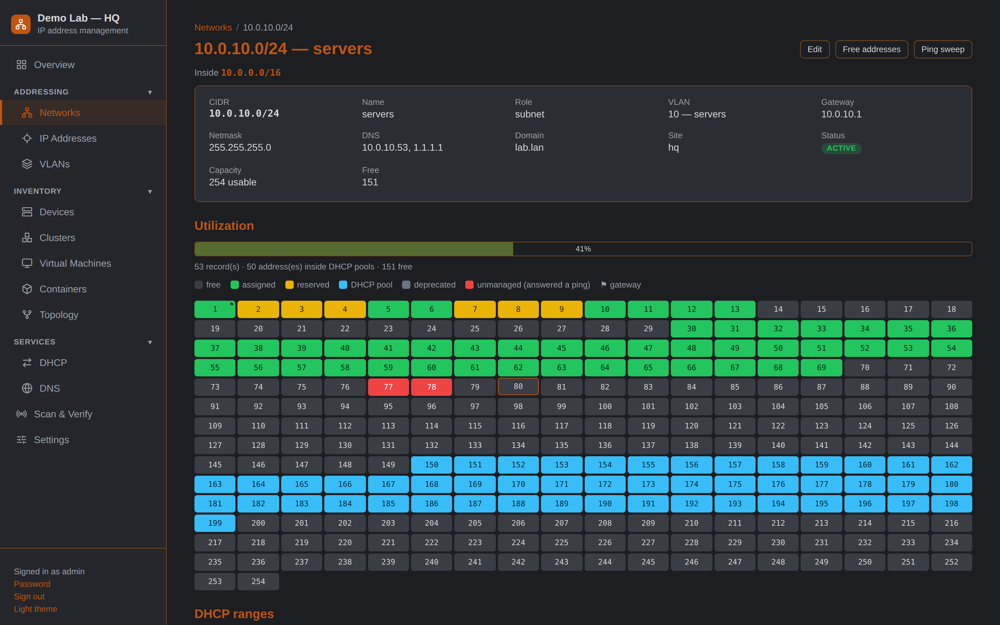
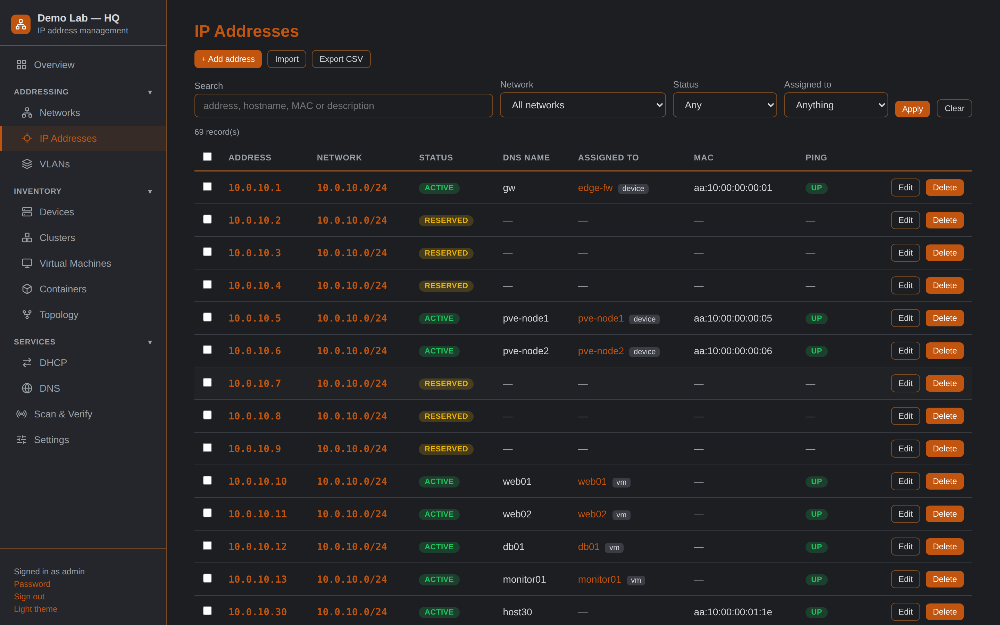
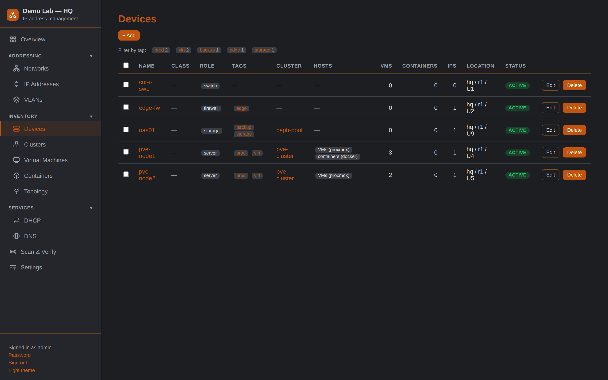
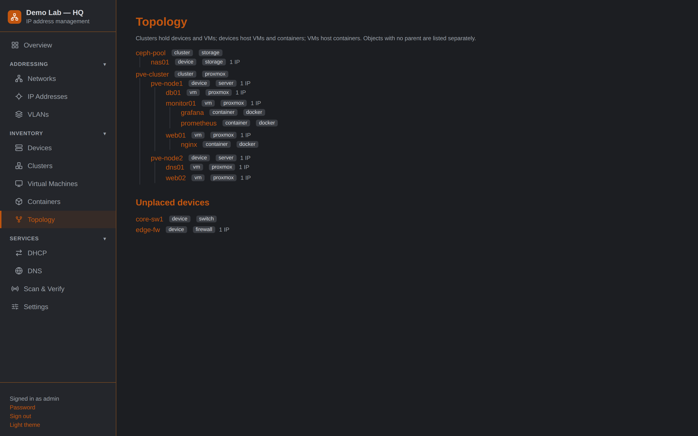
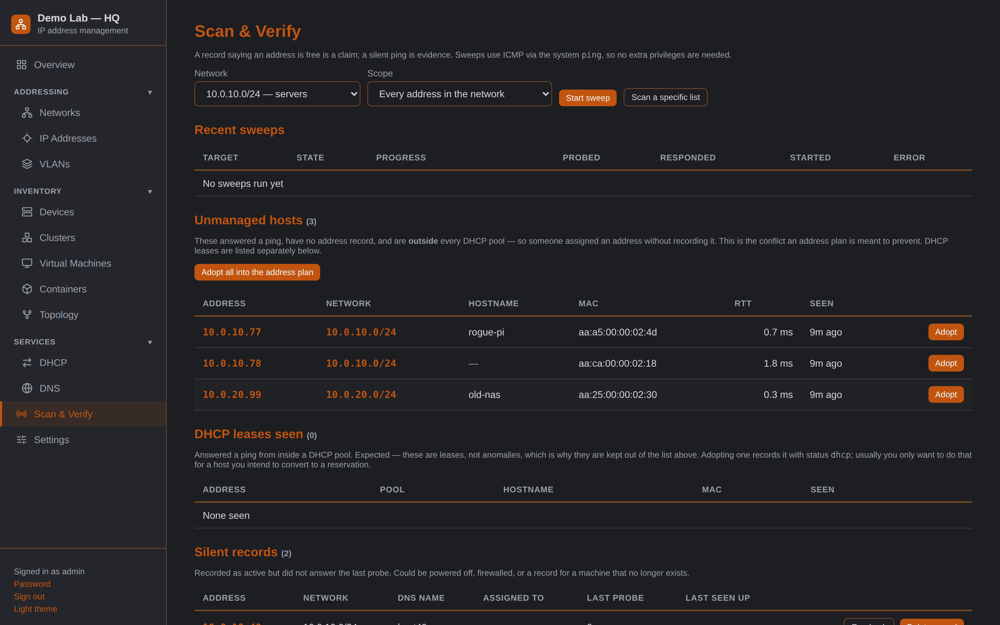

# Nexus IPAM

IP address management for a medium-to-large home lab — networks, addresses,
VLANs, DHCP pools, DNS servers, and the physical and virtual things that
consume addresses — in the Nexus Dashboard style: Python/Flask backend,
vanilla-JS frontend, no build step, dark burnt-orange theme with a light mode.
It shares its stylesheet and UI conventions with [DNSMAQ-MGR](https://github.com/brainchillz/nexus-dnsmasq-mgr)
so the two apps look and behave like one system.

The app tracks **what should be true** about your address plan and gives you
the tools to check it against **what is actually true** on the wire:

1. record networks, addresses and the devices/VMs/containers that use them;
2. see free space per subnet, with DHCP pools and reservations accounted for;
3. **ping-verify** that "free" really means free before you hand an address out;
4. **reconcile** — find hosts answering pings that nobody recorded, and records
   for machines that no longer answer.

---

## Screenshots

Seeded demo data; dark theme (a light theme is one click away).



| | |
|---|---|
|  |  |
|  |  |
|  |  |

---

## Storage: SQLite, not a database server

The brief asked to avoid a database engine if reasonable. SQLite is the right
answer here and it *is* "no engine" in the sense that matters: no server
process, no daemon, no extra dependency (it ships with Python), and the whole
dataset is one file you can copy, diff or drop in a git-crypt repo.

Flat JSON was considered and rejected. IPAM is inherently relational — an
address belongs to a network, which belongs to a VLAN; the address is assigned
to a device, which belongs to a cluster — and the hot query is a range scan
over IP space ("every address inside 10.0.0.0/23"). With JSON that means
loading everything into memory and hand-joining on every request, with no
atomicity when one action touches several files. Address allocation in
particular *must* be a single indivisible find-and-claim or two concurrent
deploys get the same IP.

At a few thousand entries SQLite is not working hard. The design comfortably
handles hundreds of thousands.

### The one clever bit

Every address is stored twice: as canonical text (`10.0.0.42`) and as a
zero-padded 32-character hex string. Fixed-width hex makes lexicographic
comparison identical to numeric comparison, so "is this address inside that
prefix" becomes an indexed `BETWEEN` — and the same code path works unchanged
for IPv4 and IPv6.

Consequently **parent/child relationships between networks are never stored**.
They are derived on read from the hex bounds, so adding `10.0.0.0/8` after
`10.1.2.0/24` already exists immediately adopts it, with no migration and no
chance of a stale tree.

---

## Features

### Networks
- **IPv4 and IPv6**, arbitrary prefix lengths, entered as any CIDR
  (`10.0.0.5/24` normalizes to `10.0.0.0/24`).
- **Supernets and subnets** in one tree, nesting derived automatically.
  Mark a big block as a *container* and it is excluded from utilization
  averages instead of skewing them.
- Per-network gateway, DNS servers, domain, site and VLAN.
- **Utilization** that counts records *and* DHCP pool spans, without
  double-counting a static reservation that sits inside a pool.
- `/31` and `/32` handled per RFC 3021 — a point-to-point link has two usable
  addresses, not zero.

### Addresses
- Status: `active`, `reserved`, `dhcp`, `deprecated`. Reserved and deprecated
  addresses stay out of allocation, which is the point of having them.
- Assigned generically to a **device, VM, container or cluster**, with an
  optional interface name, MAC, DNS name and "is primary" flag.
- **Visual IP map** — one cell per address in a subnet, coloured by state,
  with the gateway flagged; click any cell to see everything known about it.
- Bulk import (paste `IP hostname MAC` lines), CSV export, bulk span
  reservation (`.1`–`.20` for infrastructure in one call).

### Free-space and ping verification
- Free list per network, excluding records, DHCP pools and the gateway.
- **Ping check** any candidate before trusting it. Verification is not
  cosmetic: `POST /api/allocate` with `verify: true` will skip a candidate
  that answers and record it as an unmanaged host.
- **Ping sweeps** of a whole subnet, or only the addresses believed free, run
  as a background job with live progress. ICMP goes through the system `ping`
  binary, so the app needs no `CAP_NET_RAW` and no root.
- Responders get a reverse-DNS lookup and, for on-link IPv4, a MAC from the
  kernel neighbour table.

### Reconciliation
Two lists that tell you where the plan and reality disagree:
- **Unmanaged hosts** — answered a ping, no record exists. One click adopts
  them into the address plan with their discovered hostname and MAC.
- **Silent records** — recorded active, did not answer. Powered off,
  firewalled, or a ghost record to delete.

### Inventory
The containment chain a real lab actually has:

```
cluster ──┬── device (physical) ──┬── vm ── container
          └── vm                  └── container
```

- **Clusters** — Proxmox, vSphere/vCenter, Kubernetes, Nomad, **AI** (Ray, RPC
  and anything else pooling compute — the framework matters less than the fact
  that machines act as one) and **Storage** (Ceph, Gluster, …).
- **Devices** — servers, AI nodes, storage, **mixed**, switches, routers,
  firewalls, APs; with manufacturer/model/serial and rack position. A device
  declares whether it hosts VMs (`vsphere`/`proxmox`/`kvm`/…) and/or containers
  (`docker`/`lxd`/…).
- **Tags** on devices — free-form and additive, because `role` is one value and
  a real box is often several things at once. Type `#AI #Storage #Container`;
  hashes are optional and everything is lower-cased, so `#AI` and `ai` are the
  same tag however it was typed. Filter with `?tag=ai` on the API or by
  clicking a tag in the UI; `GET /api/tags` lists every tag with a count.
- **Virtual machines** — placed on a host device and/or a cluster, with
  platform, platform ID (Proxmox VMID / vSphere moref), sizing and OS.
- **Containers** — Docker, LXD, Incus, Podman, Kubernetes; parented to a
  device *or* a VM, whichever runs the engine.
- **Topology** page renders the whole tree; objects with no parent are listed
  separately rather than silently hidden.

Deleting an object that still owns addresses or still hosts children is
refused with a count, so the address plan cannot be orphaned by accident.

### DHCP and DNS
Modelled **generically**, not in any one server's config dialect — the point
is to account for the address space a pool consumes no matter what serves it.
- DHCP servers (dnsmasq, ISC, Kea, Windows, UniFi) with a management URL, so
  a server's own DNSMAQ-MGR instance is one click away.
- DHCP ranges tied to a network, overlap-checked against each other and
  bounds-checked against the network.
- DNS servers with role (authoritative / recursive / forwarder) and zones.

### Health checks
Flags real data problems, not style opinions: addresses outside every defined
network, assignments pointing at deleted objects, duplicate MACs, gateways
with no record, and unmanaged hosts.

---

## Install

### Docker

```bash
docker compose up -d --build
docker compose logs | grep -A3 'initial admin'   # first-run password
```

Then open `https://<host>:8444`. The certificate is self-signed on first run.

Bridge networking is the default and is fully functional for the UI and API.
Ping sweeps from a bridge network only reach what is routable from the
container — to scan your LAN directly, switch to the `network_mode: host`
variant commented into `docker-compose.yml`.

Prebuilt images are published to GHCR by CI (`latest` from main, semver tags
from releases), so building from source is optional:

```bash
docker run -d --name nexus-ipam -p 8444:8444 \
  -v nexus-ipam-data:/data ghcr.io/brainchillz/nexusipam:latest
docker logs nexus-ipam | grep -A3 'initial admin'
```

Set `NEXUSIPAM_ADMIN_PASSWORD` to skip the generated first-run password; the
UI forces a change on first login otherwise.

### Bare metal (Debian/Ubuntu)

```bash
sudo ./install.sh
```

Installs to `/opt/nexus-ipam`, runs as the unprivileged `nexusipam` user under
systemd. No sudoers rules are needed — the app never runs a privileged command.

### Configuration

Everything is a `NEXUSIPAM_*` environment variable:

| Variable | Default | Meaning |
|---|---|---|
| `NEXUSIPAM_DATA_DIR` | app dir | Where `ipam.db`, `auth.json` and `certs/` live |
| `NEXUSIPAM_DB` | `$DATA_DIR/ipam.db` | Database file |
| `NEXUSIPAM_PORT` | `8444` (`8081` if TLS off) | Web/API port |
| `NEXUSIPAM_TLS` | `1` | `0` serves plain HTTP (behind a TLS proxy) |
| `NEXUSIPAM_ADMIN_PASSWORD` | — | Skips the generated first-run password |
| `NEXUSIPAM_SCAN_WORKERS` | `64` | Ping concurrency |
| `NEXUSIPAM_SCAN_TIMEOUT` | `1.0` | Seconds to wait per probe |
| `NEXUSIPAM_SCAN_MAX_HOSTS` | `4096` | Ceiling on one scan job |
| `NEXUSIPAM_SCAN_RESOLVE` | `1` | Reverse-DNS responders |
| `NEXUSIPAM_MAX_ENUMERATE` | `65536` | Largest prefix the UI will draw an address map for |
| `NEXUSIPAM_BACKUP_HOURS` | `24` | Automatic JSON backups to `$DATA_DIR/backups/` (`0` disables) |
| `NEXUSIPAM_BACKUP_KEEP` | `14` | Backups retained |
| `NEXUSIPAM_AUDIT_DAYS` | `365` | Audit entries older than this are pruned daily (`0` keeps forever) |

### CLI

```bash
python nexus-ipam.py set-password admin
python nexus-ipam.py token vc-deployer admin   # prints the token once
python nexus-ipam.py scan 10.0.0.0/24          # ping sweep from the shell
python nexus-ipam.py export > backup.json
python nexus-ipam.py reindex                   # recompute address->network mapping
```

---

## API

Authentication is a session cookie (the UI) or a bearer token (automation):

```
Authorization: Bearer nx_...
X-API-Token: nx_...
```

Tokens come in two roles, and that is the read-only/writable split:

- **`readonly`** — every `GET` works, every write returns `403`. This is the
  read-only API: safe for monitoring, dashboards and anything that only asks
  questions.
- **`admin`** — can also create records and allocate addresses.

Mint them in Settings → API tokens, or with `nexus-ipam.py token <name> <role>`.

### Querying

```bash
# What is this address?  network, VLAN, assignment, DNS, pool, last ping
curl -sk -H "$AUTH" "$BASE/api/addresses/lookup?address=10.0.10.42"

# Filtered address search
curl -sk -H "$AUTH" "$BASE/api/addresses/search?network_id=2&status=active"
curl -sk -H "$AUTH" "$BASE/api/addresses/search?q=web01"

# Free space, without reserving anything
curl -sk -H "$AUTH" "$BASE/api/next-free?cidr=10.0.10.0/24&count=5"
curl -sk -H "$AUTH" "$BASE/api/next-free?network=lab-servers&verify=1"
curl -sk -H "$AUTH" "$BASE/api/networks/2/free?limit=100&ping=1"

# Inventory and topology
curl -sk -H "$AUTH" "$BASE/api/hosts"
curl -sk -H "$AUTH" "$BASE/api/topology"
curl -sk -H "$AUTH" "$BASE/api/health"
```

### Allocating (the deployer contract)

`POST /api/allocate` finds a free address and claims it in one locked step, so
concurrent deploys can never be handed the same IP. It returns the address
**plus the network's L3 facts**, so a deployment tool needs exactly one
request before it can build a VM:

```bash
curl -sk -H "$AUTH" -H 'Content-Type: application/json' -X POST \
  "$BASE/api/allocate" -d '{
    "network": "lab-servers",
    "assigned_kind": "vm", "assigned_id": 12,
    "dns_name": "web01",
    "verify": true
  }'
```

```json
{
  "success": true, "verified": true,
  "ip": "10.0.10.11", "cidr": "10.0.10.0/24",
  "prefixlen": 24, "netmask": "255.255.255.0",
  "gateway": "10.0.10.1",
  "dns": ["10.0.10.53", "1.1.1.1"],
  "domain": "lab.lan", "vlan": 10,
  "meta": {"vsphere_portgroup": "VM Network", "datastore": "ds1"}
}
```

Pass `dry_run: true` to see what *would* be allocated without writing.
`POST /api/release` frees it again (or `keep: true` to retire it as
`deprecated`).

### Update semantics — partial and safe

`POST /api/<resource>/<id>` is a **partial update**: any field you do not send
keeps its stored value; sending an explicit `""`/`null` clears it. This is
enforced centrally (the stored row is layered under the request body before
validation), so a script that updates one field can never wipe the others.
`meta` is replaced as a whole object when sent.

### Backups

The app backs itself up: a gzip'd JSON dump (restorable via
`POST /api/import/json`) is written to `$DATA_DIR/backups/` at startup and
every `NEXUSIPAM_BACKUP_HOURS` (default 24), keeping the newest
`NEXUSIPAM_BACKUP_KEEP` (default 14). Set hours to `0` to disable. A copy of
`ipam.db` itself is an equivalent backup.

### Writing

Every resource takes the same five routes:

```
GET    /api/<resource>          list      (+ ?since=<epoch> &source=<name>)
POST   /api/<resource>          create    (+ ?upsert=1)
GET    /api/<resource>/<id>     read
POST   /api/<resource>/<id>     update
DELETE /api/<resource>/<id>     delete
POST   /api/<resource>/bulk-delete    {"ids": [...]}  (max 1000)
```

Bulk delete applies the same per-record guards as a single delete — a device
still hosting VMs is refused with the reason while the rest of the batch
proceeds, and the response reports `deleted` / `refused` / `missing` so
nothing disappears silently. The UI exposes it as tick boxes + a *Delete
selected* button on the networks, addresses, VLANs and inventory pages.

for `networks`, `vlans`, `addresses`, `devices`, `vms`, `containers`,
`clusters`, `dhcp/servers`, `dhcp/ranges`, `dns/servers`.

---

## Integration

The data model was built for other tools to consume and write, which is why
every object carries:

- **`source`** — which system owns the record (`manual`, `vc-deployer`,
  `proxmox`, `discovery`, …);
- **`ext_id`** — that system's own identifier;
- **`meta`** — a free-form JSON object Nexus IPAM stores but never interprets.
  Put hypervisor placement in here (`vsphere_portgroup`, `datastore`,
  `proxmox_node`) and it comes back on every allocation.

### Idempotent sync

`POST /api/<resource>?upsert=1` matches on `(source, ext_id)`. An importer
that runs every 5 minutes updates its own records instead of duplicating them
or colliding on a unique name:

```bash
curl -sk -H "$AUTH" -X POST "$BASE/api/vms?upsert=1" -d '{
  "name": "web01", "platform": "vcenter",
  "source": "vcenter", "ext_id": "vm-9001", "vcpus": 4 }'
```

### Change feed

`GET /api/changes?since=<epoch>` returns everything modified since a
timestamp, across every table, plus a `now` value to use as the next `since`.
That is enough to keep an external system in step without re-reading
everything.

### DNSMAQ-MGR

The dnsmasq exports emit *exactly* the JSON bodies DNSMAQ-MGR's own endpoints
accept, so syncing is fetch-here / post-there with no translation:

| Nexus IPAM | feeds | DNSMAQ-MGR |
|---|---|---|
| `GET /api/export/dnsmasq/hosts` | → | `POST /api/dns/hosts` |
| `GET /api/export/dnsmasq/static-leases` | → | `POST /api/dhcp/static_leases` |
| `GET /api/export/hosts` | → | DNS page hosts-file import |
| `GET /api/export/zone?domain=lab.lan` | → | any BIND-style zone |

Bare hostnames are qualified with their network's domain on the way out.

### VC-Deployer

The allocation response maps one-to-one onto `DeploySpec`
(`ip` / `cidr` / `gateway` / `dns`), and `meta.vsphere_portgroup` carries the
portgroup name for `vm.clone -net`. A deploy becomes: allocate → clone →
`POST /api/vms?upsert=1` to record what was built. `POST /api/release` on
teardown.

### Importers

`tools/` holds the inbound half of the integrations (exports.py is outbound):

| Tool | Pulls | Notes |
|---|---|---|
| `import_dnsmasq.py` | DNS host records from a DNSMAQ-MGR primary | collapses many names per address into one record + `meta.aliases`; PTR match picks the canonical name |
| `import_unifi.py` | VLANs, networks, DHCP scopes (+ `--reservations`) from a UniFi gateway | topology only — clients are leases, the scope accounts for them |
| `import_vcenter.py` | clusters, ESXi hosts, VMs and guest addresses from vCenter | skips vCLS agents and guest IPs outside any defined network (container bridges, CNI overlays) |
| `import_nexuscontroller.py` | physical hosts and their classification from NexusController | groups multiple registry entries per machine; skips nodes that are really VMs |

Both take `--dry-run`, are idempotent via `source`/`ext_id`, and never clobber
fields another source or a human already set.

### Other exports

```
GET /api/export/json     full dump (backup / diffing)
GET /api/export/csv      flat address inventory
POST /api/import/json    restore, ?mode=merge (default) or ?mode=replace
GET /api/audit           who changed what, when (+ total, oldest, retention)
POST /api/audit/prune    admin: {"days": N} or {"all": true} — manual override
                         of the automatic daily retention
```

---

## Security notes

- Session cookies are `HttpOnly`, `SameSite=Lax`, `Secure` when TLS is on;
  sessions last 12 hours.
- Passwords are PBKDF2 (werkzeug). Login is rate-limited per IP (5 failures /
  5 minutes) and unknown usernames cost the same time as wrong passwords, so
  there is no user enumeration by timing.
- API tokens are stored as SHA-256 only and compared constant-time. A token is
  displayed exactly once, at creation.
- RBAC is enforced centrally in one `before_request` hook by HTTP method, not
  sprinkled per route — a new write endpoint is protected by default.
- No value is ever interpolated into a shell: `ping` and `ip neigh` are
  invoked with argument lists and `shell=False`.
- Every stored text field rejects line breaks, because the hosts-file, zone
  and dnsmasq exports are built by concatenation and a newline would otherwise
  smuggle a directive into someone else's config.
- SQL is parameterized throughout; the only interpolated identifiers are table
  and column names from fixed internal constants, never from user input.

---

## Repository conventions

`main` is the publishable branch: no site-specific hostnames, addresses or
credentials, in files or commit messages. Deployment facts and planning notes
live under `private/` (gitignored) and on a private-only branch that is never
pushed to a public remote. Before publishing anything, run
`tools/check_public_safe.sh` — it validates the tree, every commit message and
the full history of the current branch against your own (uncommitted) term
list.

## Development

```bash
python3 -m venv venv
./venv/bin/pip install -r requirements.txt -r requirements-dev.txt
NEXUSIPAM_TLS=0 NEXUSIPAM_DATA_DIR=./devdata ./venv/bin/python nexus-ipam.py
./venv/bin/python -m pytest tests/ -q
```

### Layout

```
nexus-ipam.py                  entrypoint + CLI dispatch
nexusipam/
  core/config.py        paths, env knobs, atomic writes
  core/db.py            SQLite schema, connection, generic CRUD
  core/auth.py          sessions, users, API tokens, RBAC
  core/validators.py    input validation + controlled vocabularies
  core/runcmd.py        shell-free command execution
  core/tls.py           self-signed generation, cert upload
  netutil.py            prefix maths, hex bounds, usable-range rules
  resource.py           generic REST machinery (one implementation, ten tables)
  networks.py           VLANs, networks, containment, utilization
  addresses.py          address records, search, lookup, bulk import
  allocate.py           free-space discovery, atomic allocation
  inventory.py          clusters, devices, VMs, containers, topology
  services.py           DHCP/DNS servers, DHCP ranges
  scan.py               ICMP prober, scan jobs, reconciliation
  exports.py            exports, import, change feed, audit
  stats.py              overview aggregates, search, health
static/js/              one file per page, no build step
templates/index.html    the single page
```

`static/css/style.css` is DNSMAQ-MGR's stylesheet verbatim, with IPAM-specific
additions (the IP map grid, network tree, state colours) appended at the end —
so a change to the shared design system can be re-copied cleanly.
